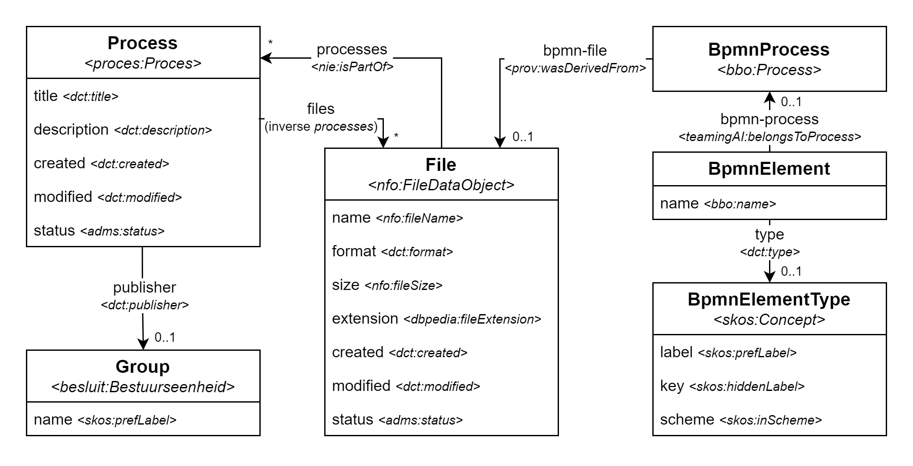
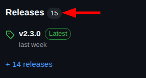
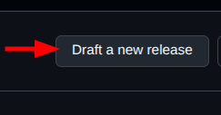
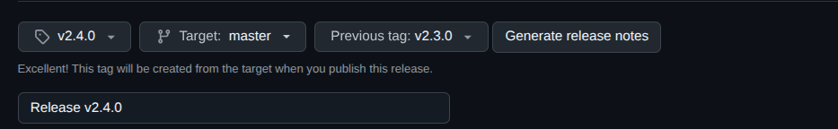

# Open Proces Huis (microservices stack)

This repo holds the docker compose and all configuration files necessary to get Open Proces Huis running. It was started using the [mu-project template](https://github.com/mu-semtech/mu-project) and has since been heavily expanded.

Open Proces Huis is one of many applications developed under the [Agentschap Binnenlands Bestuur (ABB)](https://www.vlaanderen.be/agentschap-binnenlands-bestuur), which is part of the [Flemish Government](https://www.vlaanderen.be/en). It allows for _lokale besturen_ to create and share processes. Such process is created by uploading a BPMN file, which is subsequently stored by the [file-service](https://github.com/mu-semtech/file-service), as well as processed by the [bpmn-service](https://github.com/lblod/bpmn-service). The latter was developed as part of Open Proces Huis and essentially extracts the BPMN elements from a given BPMN file and stores them as triples in the [Virtuoso](https://github.com/tenforce/docker-virtuoso) triplestore. To make all functionalities available as a web application, a [frontend](https://github.com/lblod/frontend-openproceshuis) was also developed.

In addition to the aforementioned services, a range of others are also essential to the stack. All of them are listed in [this overview](#overview-of-services), and can of course also be found in [`docker-compose.yml`](./docker-compose.yml).

## Getting started

### First run

1. Clone this repository

```bash
git clone https://github.com/lblod/app-openproceshuis.git
```

2. Add the following to `docker-compose.override.yml`

```yml
services:
  op-public-consumer:
    environment:
      DCR_LANDING_ZONE_DATABASE: "virtuoso" # Only on first run
      DCR_REMAPPING_DATABASE: "virtuoso" # Only on first run
      DCR_DISABLE_INITIAL_SYNC: "false" # Only on first run
      DCR_DISABLE_DELTA_INGEST: "true" # Only on first run
  mock-bestuurseenheid-generator:
    image: lblod/update-bestuurseenheid-mock-login-service:0.5.0
    environment:
      MU_SPARQL_ENDPOINT: "http://virtuoso:8890/sparql" # Only on first run
```

3. Run and wait for the migrations to finish

```bash
docker compose -f docker-compose.yml -f docker-compose.dev.yml -f docker-compose.override.yml up -d migrations
```

4. Run and wait for the OP consumer to finish

```bash
docker compose -f docker-compose.yml -f docker-compose.dev.yml -f docker-compose.override.yml up -d database op-public-consumer
```

5. Run and wait for the mock users to be generated

```bash
docker compose -f docker-compose.yml -f docker-compose.dev.yml -f docker-compose.override.yml up -d mock-bestuurseenheid-generator
```

6. Update `docker-compose.override.yml`

```yml
# services:
#   op-public-consumer:
#     environment:
#       DCR_LANDING_ZONE_DATABASE: "virtuoso" # Only on first run
#       DCR_REMAPPING_DATABASE: "virtuoso" # Only on first run
#       DCR_DISABLE_INITIAL_SYNC: "false" # Only on first run
#       DCR_DISABLE_DELTA_INGEST: "true" # Only on first run
#   mock-bestuurseenheid-generator:
#     environment:
#       MU_SPARQL_ENDPOINT: "http://virtuoso:8890/sparql" # Only on first run
```

7. Start the (complete) application

```bash
docker compose -f docker-compose.yml -f docker-compose.dev.yml -f docker-compose.override.yml up -d
```

> On consequent runs, only this last step should be performed.

### Usage

- You can access the frontend in your browser by going to [localhost](http://localhost/).
- You can log in using a mock account by going to [localhost/mock-login](http://localhost/mock-login).

## Data domain

All data is stored as triples in the [Virtuoso](https://github.com/tenforce/docker-virtuoso) triplestore. However, the default way of accessing this data, is by using the REST API provided by the [mu-migrations-service](https://github.com/mu-semtech/mu-migrations-service). This service acts based on [`domain.lisp`](./config/resources/domain.lisp), which stipulates how the API classes should be mapped to the resources from the triplestore. What follows, is a visualization of the domain made up of the different API classes, alonside the underlying RDF triples as can be found in the triplestore.



> The prefixes used in the diagram are equivalent to the ones used throughout the project. Their definitions can be found in [`repository.lisp`](./config/resources/repository.lisp).

> The definition of `Group` can be found in [`auth.json`](./config/resources/auth.json), alongside all other classes that are necessary for user management (not visible in the diagram).

> The `BpmnElement` class is in fact only an interface for all true BPMN element classes available. These are mapped onto RDF resources that comply with the [_BPMN Based Ontology (BBO)_](https://www.irit.fr/recherches/MELODI/ontologies/BBO/index-en.html).

## Dispatching

Different services from the stack handle different HTTP requests. The [mu-dispatcher](https://github.com/mu-semtech/mu-dispatcher) service makes sure each request gets dispatched to the correct service. The exact dispatching rules are described in [`dispatcher.ex`](./config/dispatcher/dispatcher.ex).

## Overview of services

- [frontend-openproceshuis](https://github.com/lblod/frontend-openproceshuis)
- [mu-identifier](https://github.com/mu-semtech/mu-identifier)
- [mu-dispatcher](https://github.com/mu-semtech/mu-dispatcher)
- [sparql-parser](https://github.com/mu-semtech/sparql-parser)
- [virtuoso](https://github.com/tenforce/docker-virtuoso)
- [mu-migrations-service](https://github.com/mu-semtech/mu-migrations-service)
- [mu-cl-resources](https://github.com/mu-semtech/mu-cl-resources)
- [mu-cache](https://github.com/mu-semtech/mu-cache)
- [delta-notifier](https://github.com/mu-semtech/delta-notifier)
- [file-service](https://github.com/mu-semtech/file-service)
- [bpmn-service](https://github.com/lblod/openproceshuis-bpmn-service)
- [visio-service](https://github.com/lblod/openproceshuis-visio-service)
- [account-detail-service](https://github.com/lblod/account-detail-service)
- [delta-consumer](https://github.com/lblod/delta-consumer)
- [acmidm-login-service](https://github.com/lblod/acmidm-login-service)
- [api-proxy-service](https://github.com/lblod/api-proxy-service)
- [loket-report-generation-service](https://github.com/lblod/loket-report-generation-service)
- [mock-login-service](https://github.com/lblod/mock-login-service)
- [update-bestuurseenheid-mock-login-service](https://github.com/lblod/update-bestuurseenheid-mock-login-service)

## How to make a release

Before you make a release. Here is a checklist to make sure you have everything ready before releasing. In this example we will simulate bumping from version `v2.3.0` to `v2.4.0`

### 1. Update the changelog

- Go to the `CHANGELOG.md` and update according to the merged PR's since the latest release.
- Group into sections. Currently we use:
  - :rocket: Enhancement (new features)
  - :bug: Bugfixes
  - :wrench: Maintenance
- Format using the same style as previous entries (PR number, description, author mention).
- Sort by PR number in descending order

- Commit and push the changelog

```sh
git add CHANGELOG.md
git commit -m "Release v2.4.0"
git push
```

- Create the tag and push

```sh
git tag -a v2.4.0 -m "Release v2.4.0"
git push origin v2.4.0
```

### 2. Add deploy instructions to the changelog

Backend PRs often include changes that require specific deployment steps. For example, if a migration is included, it must be rerun during deployment. If Virtuoso is upgraded in one of the PRs, it needs to be deployed carefully, as the upgrade instructions may require a different order of actions before restarting the stack.

### 3. Merge previous tag to current tag

Go to the Github UI and go to the releases page



Draft a new release





- Select the new tag in the first dropdown
- Set `master` as the target branch
- Set the previous tag
- Set the release title (eg. Release 1.4.0)
- Add the release notes in the description. As we currently are keeping track of the changes in our `CHANGELOG.md`, we can just copy and paste the changelog of the new version we previously created (without deploy instructions).
- Check `set as latest release` and click on `Publish release`
